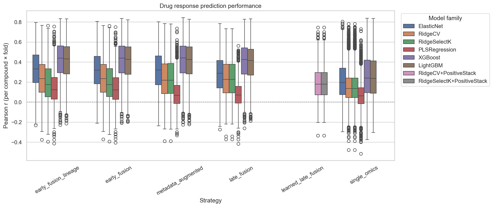
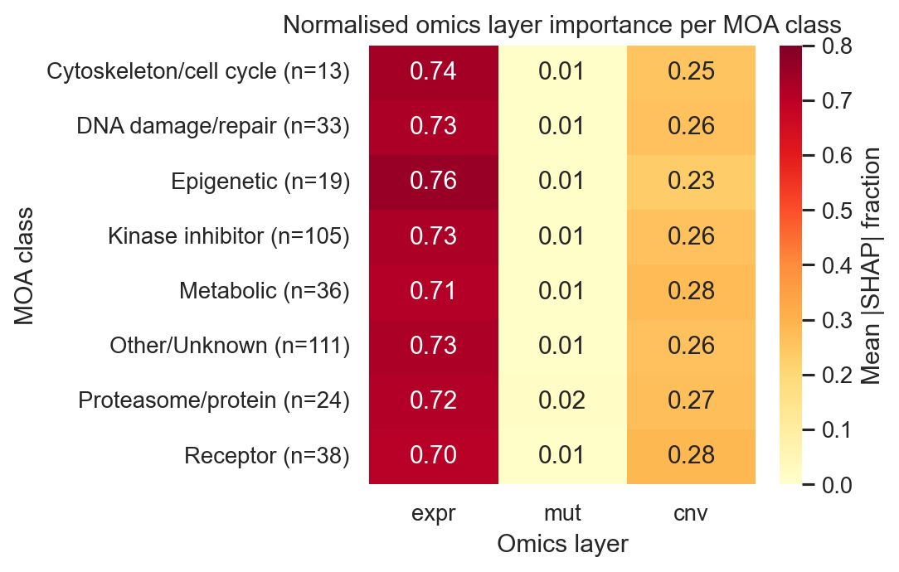
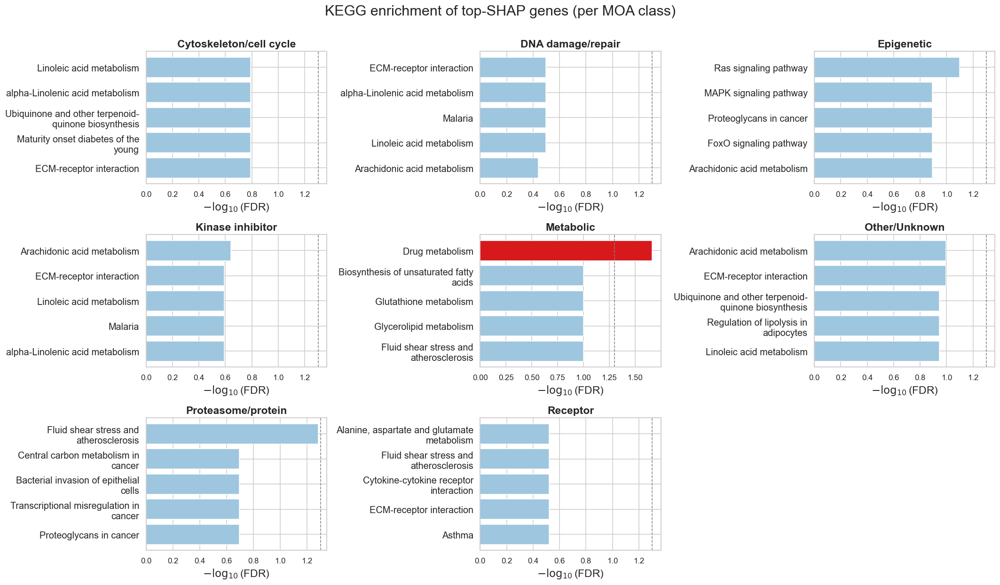

# Mechanism-Aware Drug Response Prediction with Multi-Omics Data

## Project Summary

Cancer cell lines exhibit diverse responses to anti-cancer drugs due to differences in their molecular characteristics. Integrating multiple molecular data types provides an opportunity to better understand these differences and improve drug-response prediction.

This project presents a mechanism-aware machine learning framework for predicting cancer drug response using multi-omics data from cancer cell lines. Multiple modelling strategies—including single-omics, early fusion, late fusion, and metadata-augmented approaches—were evaluated across 426 compounds using rigorous cross-validation. Model interpretation was performed using SHAP, followed by pathway enrichment analysis to investigate the biological mechanisms underlying different drug mechanism-of-action (MOA) classes.

The study combines predictive modelling with biological interpretation to identify both high-performing machine learning models and the molecular signals that drive drug response across different therapeutic mechanisms.

## Project Highlights

- **574** harmonized cancer cell lines
- **426** anti-cancer compounds evaluated
- Multi-omics integration using gene expression, mutations, copy-number variation, methylation, and proteomics
- Six machine learning models evaluated, including XGBoost and LightGBM
- **36** modelling configurations benchmarked
- **2,130** cross-validation evaluations (426 compounds × 5 folds)
- SHAP-based model interpretation across drug mechanism-of-action (MOA) classes
- KEGG and Gene Ontology pathway enrichment analysis
- Best model achieved a mean Pearson correlation of **0.4175**

## My Role & Contributions

This repository is my portfolio version of a collaborative MSc Data Science research project completed at **Freie Universität Berlin**. The original project was developed as a team effort, with different members contributing to data acquisition, modelling, biological interpretation, and documentation.

My primary responsibility focused on the **model development, evaluation, and experimental validation** stages of the project. In addition to implementing core components of the modelling workflow, I also contributed to improving the reproducibility, consistency, and presentation of the final research pipeline.

My contributions included:

- Designing and implementing fold-wise ComBat batch correction for gene expression data within the cross-validation pipeline to reduce batch effects while preventing information leakage.
- Conducting cohort-ablation experiments to evaluate the impact of different omics-layer combinations and cohort sizes on predictive performance.
- Evaluating multiple feature representations, feature-selection strategies, and dimensionality configurations to identify robust modelling approaches.
- Implementing fold-specific preprocessing and feature scaling to ensure unbiased cross-validation.
- Performing hyperparameter optimization for the Ridge + SelectKBest modelling pipeline.
- Consolidating and analyzing results from **426 compounds across 36 modelling configurations** executed on the university's Slurm compute cluster.
- Aggregating experiment outputs from Weights & Biases to identify the best-performing modelling strategies.
- Producing publication-quality visualizations used throughout the model development and evaluation workflow.
- Reviewing, refining, and improving notebook organization, experimental consistency, documentation, and result presentation across multiple stages of the project.
- Collaborating with the team on modelling decisions, experimental validation, and interpretation of the final results.

While this repository highlights my individual technical contributions, the overall project represents a collaborative research effort, and credit is shared across the project team.

## Research Question

Cancer drug response is influenced by complex molecular mechanisms that cannot be fully captured by a single omics layer. While gene expression, mutations, copy-number variation, DNA methylation, and proteomics each provide valuable biological information, their relative predictive value—and whether combining them improves performance—remains an open question.

This project investigates the following research question:

> **Which molecular data types (gene expression, mutations, DNA methylation, copy-number variation, and proteomics) are most predictive of cancer drug response, and does their relative importance differ across drug mechanism-of-action (MOA) classes?**

To answer this question, we compared multiple machine learning models, evaluated different multi-omics integration strategies, and used SHAP together with pathway enrichment analysis to interpret the biological mechanisms driving model predictions.

## Technical Workflow

The project follows an end-to-end machine learning workflow, beginning with raw multi-omics data integration and ending with biologically interpretable model predictions.

```text
Raw Multi-Omics Data
        │
        ▼
Data Harmonization & Quality Control
        │
        ▼
Feature Selection & Preprocessing
        │
        ▼
Cross-Validation Pipeline
        │
        ▼
Model Training & Evaluation
        │
        ▼
Best Model Selection
        │
        ▼
SHAP Interpretation
        │
        ▼
MOA Analysis
        │
        ▼
KEGG / GO Pathway Enrichment
```

Throughout model development, preprocessing operations—including feature scaling and batch correction—were fitted only on the training folds during cross-validation to prevent information leakage and ensure unbiased model evaluation.

## Dataset Overview

The study integrates publicly available cancer cell-line and drug-response datasets to investigate mechanism-aware drug response prediction using multiple molecular data types.

### Omics Data

The following molecular modalities were considered during the study:

| Omics Layer | Source |
|------------|--------|
| Gene Expression | DepMap Public 26Q1 |
| Somatic Mutations | DepMap Public 26Q1 |
| Copy Number Variation (CNV) | DepMap Public 26Q1 |
| DNA Methylation | CCLE |
| Proteomics | Cell Model Passports |

### Drug Response

Drug-response measurements were obtained from **CTRPv2 (Cancer Therapeutics Response Portal v2)** using Area Above the Curve (AAC) as the prediction target.

### Initial Dataset

Before cohort selection, the available datasets contained:

| Dataset | Cell Lines |
|---------|-----------:|
| Gene Expression | 1,719 |
| Somatic Mutations | 1,968 |
| Copy Number Variation | 1,118 |
| DNA Methylation | 842 |
| Proteomics | 947 |

Because not every cell line contained every omics layer, several candidate cohorts were evaluated before selecting the final modelling cohort.

## Cohort Selection & Ablation

## Cohort Selection & Ablation

A key challenge in multi-omics modelling is balancing the number of molecular modalities with the number of available samples. Requiring additional omics layers reduces the number of eligible cell lines, while removing modalities increases cohort size but may discard potentially informative biological signals.

To quantify this trade-off, cohort-ablation experiments compared different combinations of omics layers and evaluated their impact on predictive performance.

| Cohort | Cell Lines | Ridge Pearson | XGBoost Pearson |
| --- | ---: | ---: | ---: |
| Five omics | 389 | 0.560 | 0.535 |
| Four omics (without proteomics) | 508 | 0.586 | 0.567 |
| Three omics (without proteomics and methylation) | **574** | **0.604** | **0.596** |

The results showed that increasing the number of available cell lines had a greater impact on prediction performance than retaining every omics layer. Although removing proteomics and methylation reduced the amount of molecular information available, the larger cohort consistently produced better predictive performance.

These experiments informed the selection of the final modelling cohort consisting of **574 cancer cell lines** using **gene expression, somatic mutations, and copy-number variation**.

> **My contribution:** I designed and conducted the cohort-ablation experiments, compared alternative cohort configurations, and analyzed the trade-offs between cohort size, omics availability, and predictive performance to support the final modelling decisions.

## Model Evaluation

A total of **36 modelling configurations** were evaluated across **426 eligible compounds** using five-fold cross-validation, resulting in **2,130 individual compound-fold evaluations**.

The experiments compared:

- Single-omics models
- Early multi-omics fusion
- Late fusion
- Metadata-augmented models
- Linear and tree-based machine learning algorithms

Performance was evaluated using:

- Pearson Correlation (primary metric)
- Spearman Correlation
- RMSE
- MAE
- R²

The table below summarises the highest-performing configurations.

## Final Model Performance

The table below presents the ten best-performing modelling configurations across the complete benchmark.

| Rank | Model | Strategy | Features | Pearson | Spearman | R-squared | RMSE |
| ---: | --- | --- | --- | ---: | ---: | ---: | ---: |
| 1 | XGBoost | Early fusion | Multi-omics | **0.4175** | **0.3700** | **0.1800** | **0.0855** |
| 2 | XGBoost | Early fusion + lineage | Multi-omics + lineage | 0.4174 | 0.3693 | 0.1798 | 0.0855 |
| 3 | XGBoost | Metadata augmented | Expression + lineage | 0.4174 | 0.3694 | 0.1789 | 0.0856 |
| 4 | XGBoost | Single omics | Expression | 0.4163 | 0.3683 | 0.1778 | 0.0857 |
| 5 | LightGBM | Early fusion + lineage | Multi-omics + lineage | 0.4087 | 0.3615 | 0.1727 | 0.0860 |
| 6 | LightGBM | Early fusion | Multi-omics | 0.4085 | 0.3612 | 0.1723 | 0.0861 |
| 7 | LightGBM | Single omics | Expression | 0.4054 | 0.3576 | 0.1690 | 0.0863 |
| 8 | LightGBM | Metadata augmented | Expression + lineage | 0.4052 | 0.3579 | 0.1691 | 0.0863 |
| 9 | XGBoost | Late fusion | Expression + mutations + CNV | 0.4016 | 0.3507 | 0.1397 | 0.0885 |
| 10 | LightGBM | Late fusion | Expression + mutations + CNV | 0.3924 | 0.3418 | 0.1320 | 0.0889 |

## Key Findings

The experimental evaluation produced several important insights:

- **Early multi-omics fusion consistently achieved the strongest predictive performance**, with XGBoost producing the highest overall Pearson correlation.
- **Gene expression remained the single most informative molecular modality**, performing competitively even without additional omics layers.
- **Increasing cohort size had a larger impact than retaining every omics layer**, highlighting the importance of sample availability in predictive modelling.
- **Tree-based ensemble methods consistently outperformed linear models** across the strongest-performing configurations.
- Incorporating lineage metadata produced only modest improvements, suggesting that molecular information already captured much of the variation associated with tissue lineage.

These findings demonstrate that carefully designed multi-omics integration strategies can improve predictive performance while maintaining biological interpretability.

## Performance Visualization

The figure below summarises cross-validated Pearson correlation across the evaluated modelling strategies.



The distribution of performance across compounds highlights the variability in prediction difficulty while demonstrating the consistent advantage of tree-based ensemble methods. XGBoost with early multi-omics fusion achieved the best overall performance (mean Pearson = 0.4175).

## Key Technical Decisions

Several design choices were made to improve the robustness, reproducibility, and biological validity of the modelling pipeline.

| Decision | Motivation |
|-----------|------------|
| Fold-wise StandardScaler | Prevent information leakage during cross-validation |
| Fold-wise ComBat batch correction | Remove batch effects while preserving unbiased evaluation |
| Five-fold cross-validation | Produce robust performance estimates across compounds |
| Pearson correlation as the primary metric | Measure agreement between predicted and observed drug response |
| Multiple feature-selection strategies | Compare predictive performance across different feature representations |
| SHAP values | Interpret feature importance for individual compounds and MOA classes |
| KEGG & Gene Ontology enrichment | Connect predictive features with underlying biological pathways |
| Fixed random seeds | Improve reproducibility across experiments |

> **My contribution:** I implemented several of these experimental design decisions, including fold-wise preprocessing, batch correction, cohort evaluation, hyperparameter optimization, and comparative benchmarking to ensure the modelling pipeline remained reproducible and free from information leakage.

## Mechanism-of-Action (MOA) Annotation

Understanding *why* a model makes accurate predictions requires grouping compounds according to their biological mechanisms. However, publicly available mechanism-of-action (MOA) annotations were incomplete and inconsistent across different databases.

To maximise compound coverage, a multi-source annotation workflow combined information from:

- ChEMBL
- PRISM Repurposing Hub
- PubChem
- Manual literature review

This progressive annotation strategy substantially increased MOA coverage before downstream biological interpretation.

| Annotation Stage | Compounds Resolved |
|------------------|-------------------:|
| Initial ChEMBL matching | 110 / 544 (20%) |
| Multi-source automatic annotation | 233 / 544 (43%) |
| Team manual review | **323 / 544 (59%)** |

To improve statistical reliability, MOA classes represented by fewer than five compounds were merged into a single **Other/Unknown** category before downstream analysis.

## Model Interpretation with SHAP

To understand which molecular features contributed to model predictions, SHAP (SHapley Additive exPlanations) was applied to the best-performing modelling configuration.

Rather than analysing a single trained model, SHAP values were computed across the five cross-validation folds and aggregated to obtain stable feature-importance estimates for each compound.

Overall:

- SHAP analysis successfully completed for **379 of 426 compounds**
- The remaining compounds primarily consisted of combination therapies that could not be reliably interpreted using the current workflow
- Feature importance scores were aggregated by gene, omics layer, compound, and MOA class to support downstream biological interpretation

This approach enabled direct comparison of the molecular signals driving prediction across different drug mechanisms.

## SHAP Results

The figure below summarises the relative contribution of each omics layer across the resolved MOA classes.



Gene expression consistently provided the strongest predictive signal across most drug mechanism classes, while mutations and copy-number variation contributed additional information for specific therapeutic mechanisms. These findings demonstrate that the predictive importance of molecular features depends on the biological mechanism targeted by each drug class.

## Biological Pathway Enrichment

To investigate the biological processes underlying the model predictions, pathway enrichment analysis was performed using the top 30 genes ranked by mean absolute SHAP value for each MOA class.

Enrichment analysis was carried out across multiple pathway databases, including:

- KEGG
- Gene Ontology (Biological Process, Molecular Function, and Cellular Component)
- Reactome
- MSigDB Hallmark

Rather than using the entire genome as the background, enrichment was performed against the **2,804 genes** included in the modelling pipeline, providing a more appropriate statistical comparison.

### Key Findings

The analysis identified several biologically meaningful, mechanism-specific pathways, including:

- **Drug metabolism** pathways for metabolic-targeting compounds.
- **EGFR signalling** enrichment for epigenetic drug classes.
- **Rho signalling** pathways shared across kinase inhibitor and receptor-targeting compounds.

These results demonstrate that the molecular features identified by the predictive models correspond to established biological pathways, supporting the biological relevance of the modelling framework.



## Biological Findings

Across all pathway libraries and MOA classes, **36 pathways** remained statistically significant after false discovery rate correction.

Notable findings included:

- **Drug metabolism (KEGG)** enrichment within the Metabolic drug class.
- Strong **EGFR signalling** enrichment for Epigenetic compounds.
- Shared **Rho signalling** pathways across Kinase Inhibitor and Receptor-targeting drug classes.
- Many additional enriched pathways represented general cellular fitness processes shared across multiple drug mechanisms.

These results demonstrate that the predictive models captured biologically meaningful molecular patterns rather than relying solely on statistical associations.

## Future Work

Several opportunities remain to extend this work:

- Perform more extensive hyperparameter optimization for tree-based models using larger computational resources.
- Evaluate the complete feature space without aggressive dimensionality reduction.
- Incorporate tissue-specific modelling to better capture lineage-dependent drug response.
- Extend batch-correction experiments to the full dataset.
- Integrate chemical structure information (e.g. SMILES representations) alongside molecular features.
- Evaluate larger multi-omics cohorts as additional datasets become available.

These extensions may further improve predictive performance while providing deeper biological insight into drug-response mechanisms.

## Technical Skills Demonstrated

- Machine Learning
- Multi-Omics Data Integration
- Feature Engineering
- Cross-Validation
- Hyperparameter Optimisation
- Batch Effect Correction
- Explainable AI (SHAP)
- Biological Pathway Analysis
- Statistical Evaluation
- Python
- Pandas
- Scikit-learn
- XGBoost
- LightGBM
- Weights & Biases

## Workflow

### 1. Clone the repository

```bash
git clone https://github.com/Hrishikesh332/Multi-Omics-Mechanism-Modelling-AAC.git
cd Multi-Omics-Mechanism-Modelling-AAC
```

### 2. Create the environment


```bash
python3 -m venv .venv
source .venv/bin/activate
python -m pip install jupyter pandas numpy scipy scikit-learn umap-learn \
  matplotlib seaborn requests pyarrow tqdm upsetplot joblib \
  xgboost lightgbm shap gseapy
```

### 3. Execute the notebooks

Run the notebooks in this order:

1. `01_data_prep_eda.ipynb` prepares and explores the multi-omics and drug-response data.
2. `02_model_development_final.ipynb` trains and evaluates the prediction models.
3. `03_shap_moa_analysis.ipynb` calculates SHAP importance and compares results across MOA classes.
4. `04_kegg_go_enrichment.ipynb` performs pathway enrichment on SHAP-derived genes.

The cohort-ablation notebooks document the exploratory experiments that informed the selection of the final modelling cohort and feature representations. While they provide important experimental context for the modelling decisions, they are not required to reproduce the final prediction pipeline. They are included to provide transparency into the research process.

The first two cells of `03_shap_moa_analysis.ipynb` mount and copy data from Google Drive (https://drive.google.com/drive/folders/1g__yAP27zH_jbzOgOH6KYWU8gNetdW4h?usp=sharing - 426 compounds results); skip them when running locally.

## Experimental Design

| Component | Description |
|-----------|-------------|
| Prediction Target | Compound-specific AAC |
| Eligibility | ≥250 cell lines and AAC SD ≥0.04 |
| Omics Layers | Expression, Mutations, CNV |
| Integration | Single, Early Fusion, Late Fusion, Metadata-Augmented |
| Models | ElasticNet, RidgeCV, RidgeSelectK, PLSRegression, XGBoost, LightGBM |
| Validation | Five-fold Cross Validation |
| Metrics | Pearson, Spearman, RMSE, MAE, R² |
| Interpretation | SHAP + KEGG + GO |

Random seeds are fixed to 42 where supported. Feature scaling, selection, and batch correction are applied within training folds to reduce information leakage.

## Experiment tracking

Weights & Biases logging is disabled by default.

```bash
python -m pip install wandb
wandb login
```

Then update the configuration in `02_model_development_final.ipynb`:

```python
USE_WANDB = True
WANDB_PROJECT = "multiomics-drug-response-v4"
WANDB_ENTITY = None
WANDB_MODE = "online"
```

